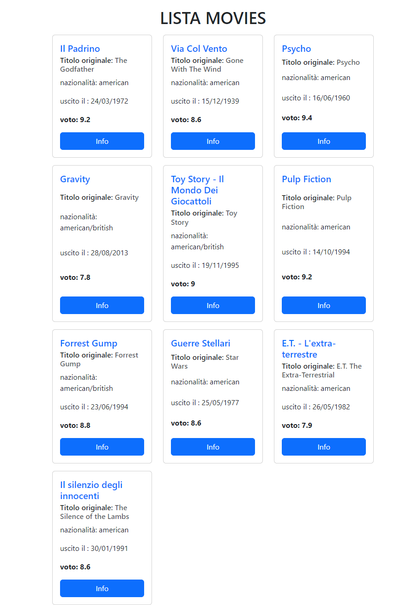

> Esercizio ...



## ...

- DESCRIZIONE:
  - 

- MILESTONE 1 :
  -  

- BONUS
  - 

- CONSIGLI:
  - 

```javascript CODE
```

## Tecnologie

- HTML
- CSS
- JAVASCRIPT
- TAILWIND CSS / SASS / BOOTSTRAP 
- VUE JS
- AXIOS
- LARAVEL
- Git e Github